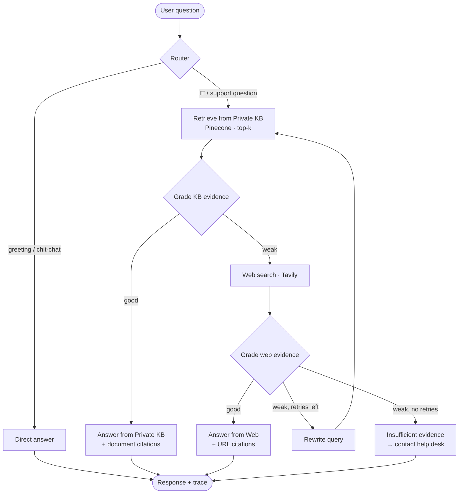

<div align="center">

# 🛠️ Enterprise IT Support — Agentic RAG Copilot

### 🚀 [Live Demo → https://34-73-58-61.nip.io/](https://34-73-58-61.nip.io/)

</div>

## ✨ Why this isn't "just another RAG chatbot"

Most RAG demos retrieve a few chunks and hope for the best. This copilot is an **agentic workflow** built on LangGraph that *decides* what to do at each step:

| Capability | What it does |
|---|---|
| 🧭 **Smart routing** | An LLM router sends greetings and small talk straight to a direct reply. IT questions go to the knowledge base. |
| 📚 **Private KB retrieval** | Pulls the top-k most relevant chunks from your company documents stored in Pinecone. |
| ⚖️ **Self-grading evidence** | An LLM grader judges whether the retrieved evidence is actually good enough to answer from. |
| 🌐 **Web fallback** | If the KB is weak, it searches the web with Tavily, and labels the answer as external info that needs IT validation. |
| 🔁 **Query rewriting** | If the web results are weak too, it rewrites the query with better technical keywords and tries again. |
| 🛑 **Honest refusal** | If nothing reliable turns up, it says so instead of making up an answer. |
| 🔍 **Full agent trace** | Every answer comes with a step-by-step trace and citations, shown live in the UI. |
| 🧾 **Audit log** | Every question, the source used and the trace are saved to SQLite for compliance and review. |
| 📤 **Admin document upload** | Drop in PDF, DOCX, MD or TXT files from the UI. They're chunked, embedded and indexed right away. |

---

## 🧠 How the agent thinks



A typical trace looks like this:

```
Router → KB
Private KB retrieval → 4 chunks
KB evidence grade → GOOD
Answer generation → PRIVATE KB
```

---

## 🏗️ Tech stack

| Layer | Technology |
|---|---|
| API & web server | FastAPI, Uvicorn |
| Agent orchestration | LangGraph (`StateGraph`) |
| LLM | OpenAI `gpt-4o-mini` (configurable) |
| Embeddings | OpenAI `text-embedding-3-small` (1536-dim) |
| Vector store | Pinecone Serverless (AWS `us-east-1`, cosine) |
| Web search | Tavily |
| Document parsing | PyPDF, python-docx, LangChain loaders |
| Chunking | `RecursiveCharacterTextSplitter` (900 chars, 120 overlap) |
| Audit storage | SQLite |
| Frontend | Jinja2 template + vanilla JS/CSS |

---

## 📁 Project structure

```
Enterprice_RAG_Copilot/
├── app/
│   ├── main.py               # FastAPI app, static files, home page
│   ├── api/
│   │   └── routes.py         # /api/chat and /api/ingest endpoints
│   ├── core/
│   │   ├── config.py         # Pydantic settings loaded from .env
│   │   └── logging.py        # Logging setup
│   ├── rag/
│   │   ├── workflow.py       # LangGraph agent: router, graders, generators
│   │   ├── state.py          # Agent state + structured output schemas
│   │   └── vectorstore.py    # Pinecone index management & retriever
│   └── services/
│       ├── ingestion.py      # File loading & chunking
│       └── audit.py          # SQLite audit log
├── data/
│   └── sample_kb/            # Sample IT handbook & service desk runbook
├── static/                   # CSS & JS for the chat UI
├── templates/
│   └── index.html            # Chat UI with agent trace panel
├── ingest_sample_kb.py       # One-shot script to index the sample KB
├── run.py                    # Dev server entry point
└── requirements.txt
```

> ⚠️ **Variable names must match exactly.** Any variable the app doesn't recognize is silently ignored and the default is used instead. Also note it's `gpt-4o-mini` with the **letter o**, not `gpt-40-mini`.

### 4. Index the sample knowledge base

```bash
python ingest_sample_kb.py
```

```
Indexed 2 files -> N chunks -> N Pinecone vectors
```

The Pinecone index is **created automatically** on the first run.

### 5. Run the app

```bash
python run.py
```

Open **http://127.0.0.1:8080** and try:

- *"How do I connect to the company VPN?"* → answered from the **private KB**
- *"What is our password reset policy?"* → answered from the **private KB**
- *"What is the latest Microsoft Teams outage guidance?"* → falls back to **web search**
- *"Hi there!"* → **direct reply**, no retrieval

---

## 🔌 API reference

Interactive docs are available at **`/docs`** (Swagger UI) once the server is running.

### `POST /api/chat`

Ask the copilot a question.

```bash
curl -X POST http://127.0.0.1:8080/api/chat \
  -H "Content-Type: application/json" \
  -d '{"question": "How do I reset my MFA device?"}'
```

```json
{
  "answer": "Based on the company's private knowledge base...",
  "source_used": "private_kb",
  "trace": [
    "Router → KB",
    "Private KB retrieval → 4 chunks",
    "KB evidence grade → GOOD",
    "Answer generation → PRIVATE KB"
  ],
  "citations": [{ "title": "company_it_handbook.md", "url": "", "type": "private_kb" }],
  "rewritten_query": "How do I reset my MFA device?"
}
```

`source_used` is one of `private_kb`, `web_search`, `direct` or `insufficient_evidence`.

### `POST /api/ingest`

Upload and index a company document. **Requires the admin key.**

```bash
curl -X POST http://127.0.0.1:8080/api/ingest \
  -H "X-Admin-Key: your-strong-secret" \
  -F "file=@./docs/onboarding_guide.pdf"
```

```json
{ "message": "Document indexed", "file": "onboarding_guide.pdf", "chunks": 12, "ids_created": 12 }
```

Supported formats: **`.pdf`**, **`.docx`**, **`.md`**, **`.txt`**

---

## ⚙️ Configuration reference

| Variable | Default | Description |
|---|---|---|
| `OPENAI_API_KEY` | — | **Required.** Used for the LLM and embeddings |
| `PINECONE_API_KEY` | — | **Required.** Vector database |
| `TAVILY_API_KEY` | — | **Required** for web fallback |
| `ADMIN_API_KEY` | `change-me` | Secret for `/api/ingest`. **Change it before deploying** |
| `OPENAI_MODEL` | `gpt-4o-mini` | Chat model for routing, grading and answering |
| `EMBEDDING_MODEL` | `text-embedding-3-small` | Also supports `text-embedding-3-large` and `ada-002` |
| `PINECONE_INDEX_NAME` | `fde-it-support-rag` | Created automatically if missing |
| `PINECONE_NAMESPACE` | `company-it-kb` | Namespace inside the index |
| `TOP_K` | `4` | Number of chunks retrieved per query |
| `MAX_RETRIES` | `1` | Query-rewrite attempts before giving up |
| `APP_NAME` | `Enterprise IT Support Agentic RAG Copilot` | Shown in the UI title |

> ⚠️ **Heads up:** if you change `EMBEDDING_MODEL` to one with a different dimension, the app **deletes and recreates** the Pinecone index to match. You'll then need to re-ingest your documents.

---

## 🧾 Audit log

Every chat request is recorded in `data/audit.db`:

| Column | Description |
|---|---|
| `created_at` | UTC timestamp |
| `question` | The user's question |
| `source_used` | `private_kb`, `web_search`, `direct` or `insufficient_evidence` |
| `trace_json` | The full agent trace as JSON |

```bash
sqlite3 data/audit.db "SELECT created_at, source_used, question FROM query_audit ORDER BY id DESC LIMIT 10;"
```

---


⭐ If you find this useful, give it a star!

</div>
